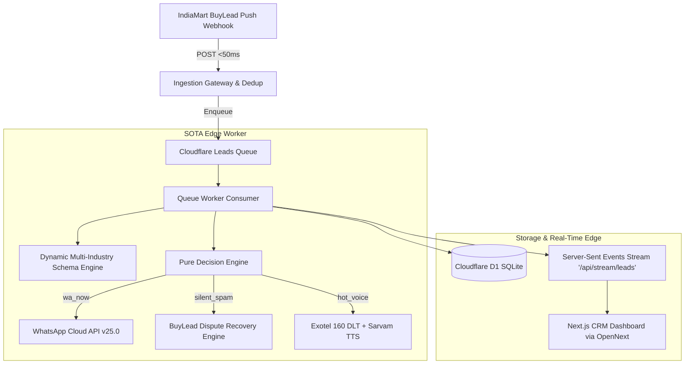

# ⚡ IndiaMart Lead Speed Engine & Turnkey B2B CRM

An ultra-low latency, autonomous B2B lead ingestion, dynamic catalog qualification, and sub-45-second quotation engine for Indian MSME suppliers on IndiaMart.

Built on **Cloudflare Workers (Edge Engine)**, **Sarvam AI (Multilingual Voice)**, **Exotel 160 DLT Telephony**, **Meta WhatsApp Cloud API v25.0**, and **Next.js 15 via OpenNext**.

---

## 🚀 Key Features & Capabilities

1. **Sub-45s Ingestion & WhatsApp Dispatch SLA**:
   - Ingests raw IndiaMart Push Webhooks in `<50ms` with Cloudflare D1 atomic deduplication (`UNIQUE_QUERY_ID`).
   - Automatically parses buyer inquiries and delivers branded WhatsApp quotations with dynamic PDF datasheets before competitors react.

2. **Dynamic Multi-Industry Schema Engine**:
   - Replaces hardcoded parameters with dynamic, multi-domain attribute extractors (**Industrial Pumps**, **Air Compressors**, **Diesel Generators**, **Solar Inverters**, and **Custom B2B Goods**).
   - Real-time unit normalization: $\text{kW} \rightarrow \text{HP}$, $\text{PSI} \rightarrow \text{Bar}$, $\text{m}^3/\text{hr} \rightarrow \text{LPM}$, $\text{feet} \rightarrow \text{meters}$.

3. **Automated BuyLead Dispute & Credit Recovery Engine**:
   - Analyzes incoming inquiries against IndiaMart Buyer Quality Policy §3.2 (academic projects/PPTs) and §1.4 (invalid/dummy numbers).
   - Auto-generates formal credit refund dispute claims, recovering **₹350–₹500 per junk lead**.

4. **Dual-Mode SOTA Voice Subsystem**:
   - **Mode A (High-Speed Telephony Bridge)**: Exotel 160 DLT service route + Sarvam Bulbul v2/v3 TTS (`te-IN` Telugu, `hi-IN` Hindi, `en-IN` English) with instant DTMF 1 live buyer-to-dealer connect.
   - **Mode B (Autonomous Conversational Voice Agent)**: Real-time turn-by-turn conversational buyer qualification.

5. **Edge-Native PDF Quotation Generator**:
   - Generates binary PDF-1.4 commercial quotations in `<3ms` on Cloudflare Workers edge with seller GSTIN, technical specs, pricing breakdown, warranty, and UPI VPA payment link.

6. **Safety Net Hybrid Ingestion Reconciler**:
   - A 5-minute scheduled Cloudflare cron reconciles leads from the IndiaMart GLUSR Pull CRM API, ensuring 100% lead capture with zero duplicates.

7. **60-Second Guided Seller Onboarding Wizard**:
   - Self-serve onboarding flow at `/onboard`: Company Profile $\rightarrow$ Industry Schema $\rightarrow$ Push Webhook Gateway $\rightarrow$ Live Test Lead Simulation with instant PDF Quote preview.

---

## 🏗️ Architecture



---

## 📦 Quick Start & Development

### 1. Install Dependencies
```bash
# In repository root
bun install
```

### 2. Run Local Development
```bash
# Start Worker backend on port 8787
cd apps/worker
bun run dev

# Start Next.js CRM frontend on port 3000
cd apps/web
bun run dev
```

### 3. Run Production Simulation CLI
```bash
cd apps/worker
bun run simulate
```

### 4. Run Test Suite
```bash
cd apps/worker
bun test test/sota-engine.test.ts test/domain.test.ts test/ingest.test.ts test/consumer.test.ts
```
*32/32 tests passing with 130 assertions.*

---

## 🚢 Cloudflare & OpenNext Production Deployment

### Worker Backend (`apps/worker`)
```bash
cd apps/worker
bun run check
bun run db:migrate
bunx wrangler deploy
```

### Web CRM Frontend via OpenNext (`apps/web`)
```bash
cd apps/web
bun run check
bunx @opennextjs/cloudflare build
bunx @opennextjs/cloudflare deploy
```

---

## 📄 License
Private & Proprietary · Bharat Pumps & Equipment Co. / IndiaMart Lead Speed Engine.
